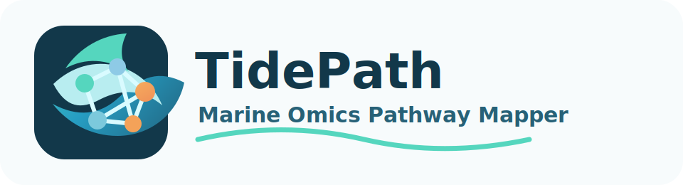

<p align="center">
  
</p>

# TidePath: Marine Omics Pathway Mapper

A free, browser-based tool for mapping marine and non-model organism omics results
onto biological pathways. It ingests differential expression (DEG), differential
methylation (DMR), proteomics, metabolomics, or multi-omics tables; maps
identifiers to pathway entities directly or through orthology to a reference
organism; and produces interactive, publication-ready pathway diagrams using open
pathway resources (WikiPathways and Reactome).

**Everything runs client-side.** Your data never leaves your computer, and no API
key is required for ordinary use.

## Highlights

- **Flexible input** — CSV / TSV / XLSX / pasted text; multiple tables; automatic
  column detection with full manual override.
- **Built for non-model organisms** — direct, ortholog-reference, or user-supplied
  ortholog-table mapping, with one-to-many and distant-reference ambiguity made
  explicit.
- **Transparent by design** — a clear distinction between a descriptive *mapping
  summary* and a statistical *enrichment analysis* (Fisher's exact + Benjamini-
  Hochberg, only when a background universe is supplied), plus visible uncertainty
  warnings throughout.
- **Interactive visualization** — zoom/pan pathway diagrams, multi-omics node
  styling, colorblind-aware palettes, per-node detail panels, and SVG/PNG export.
- **Reproducible** — deterministic layout and scoring; exportable audit tables,
  session files, and an auto-generated methods paragraph.
- **Open pathway data only** — WikiPathways (CC0) and Reactome (CC-BY 4.0). KEGG is
  link-out only; no proprietary images are redistributed.

## Quick start

```bash
# Node 20+ recommended
npm install
npm run dev        # start the dev server
npm run build      # production build to dist/
npm run preview    # preview the production build
npm test           # run the unit + integration test suite
npm run typecheck  # TypeScript type checking
```

Then open the app and click **Load demo data** to explore a bundled multi-omics
example end to end.

## Deployment

The app is a static site — deploy `dist/` to any static host.

- **GitHub Pages:** build with a base path matching your repo, e.g.
  ```bash
  VITE_BASE=/marine-pathway-mapper/ npm run build
  ```
  then publish `dist/`. The base path defaults to `/` for local dev and other hosts.
- **Netlify / Vercel:** build command `npm run build`, publish directory `dist`.

## Technology

React + TypeScript + Vite + Tailwind CSS, D3.js for visualization and layout,
papaparse and SheetJS (xlsx) for client-side parsing, Vitest for testing.

## Documentation

- [User Guide](docs/USER_GUIDE.md) — full walkthrough of the six-step workflow.
- [Data Model](docs/DATA_MODEL.md) — types, the transformation pipeline, and the
  transparency guarantees.
- [Sources & Attribution](docs/SOURCES.md) — bundled pathways, licenses, and how
  they were obtained.

## Sample data

The `sample_data/` directory (also served at `public/samples/`) contains example
DEG, DMR, metabolomics, and ortholog tables you can load from the Upload page.

## Testing

The suite covers column detection, identifier normalization, one-to-many ortholog
handling, mapping summaries, the color scale, CSV/TSV export, enrichment statistics,
and an end-to-end pipeline run on the demo dataset.

```bash
npm test
```

## Scope & limitations

The bundled pathway library is a curated static core for offline use, not the
complete WikiPathways/Reactome collection (live API synchronization is a planned
modular extension). Pathway layouts are readable approximations, not byte-for-byte
reproductions of the source diagrams. Ortholog-based mappings are annotations, not
direct evidence — interpret results with orthology quality, annotation
completeness, and background choice in mind. Pathway overlap does not imply
causation.

## License

Application code: **MIT**. Bundled pathway data retains its original source
licenses (WikiPathways **CC0**, Reactome **CC-BY 4.0**). See
[docs/SOURCES.md](docs/SOURCES.md).
